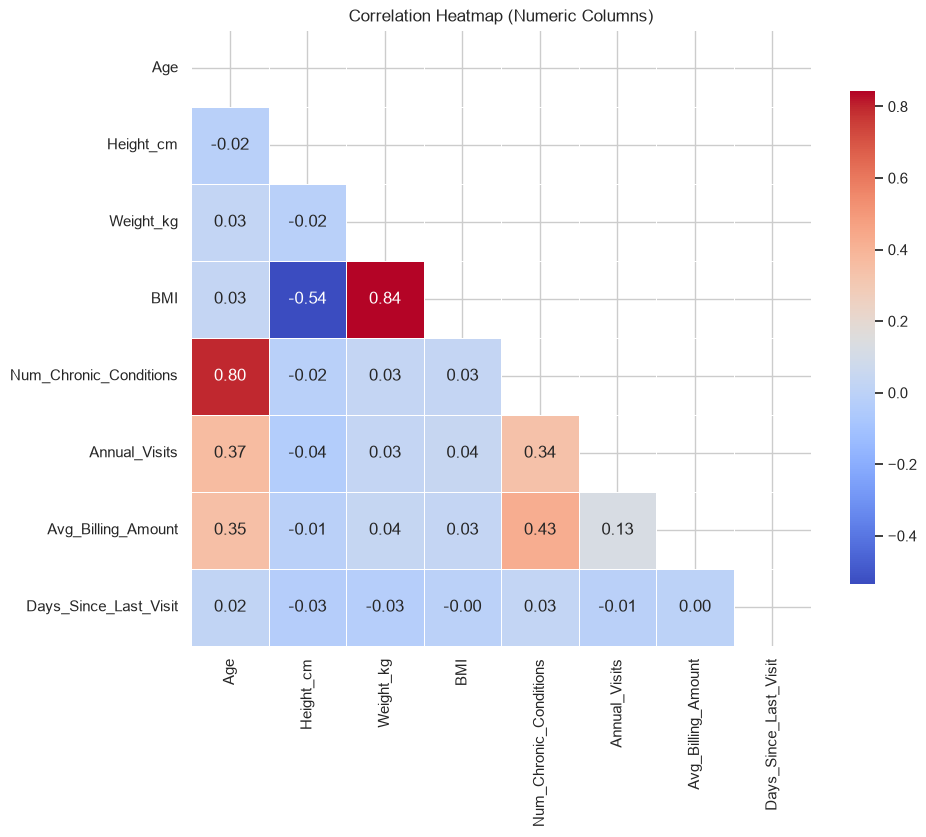
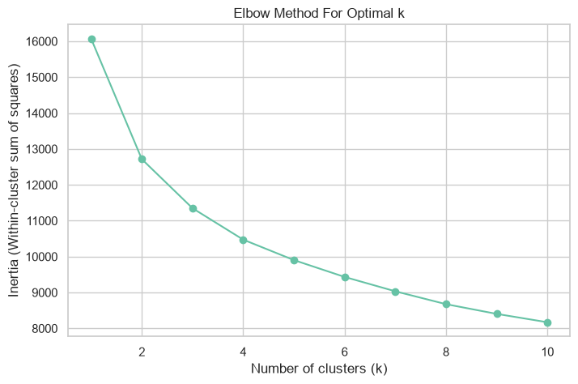
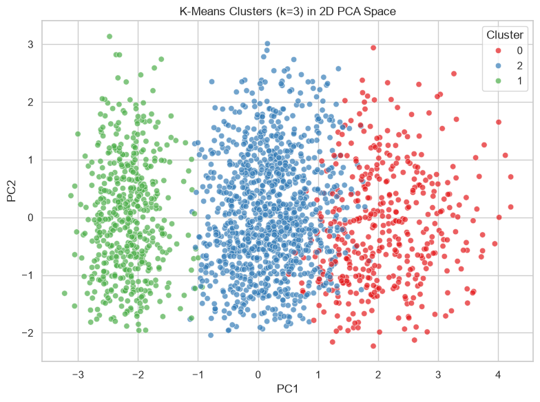
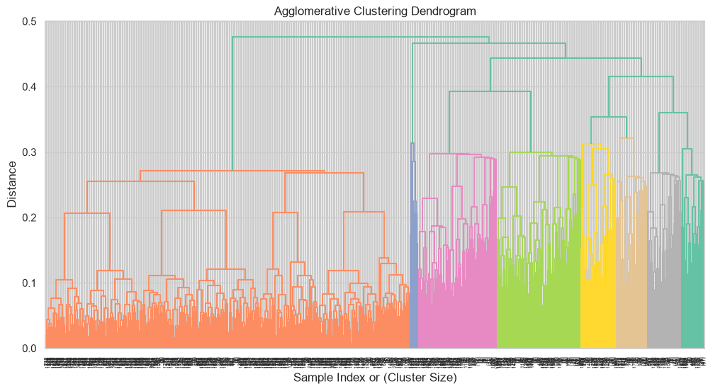
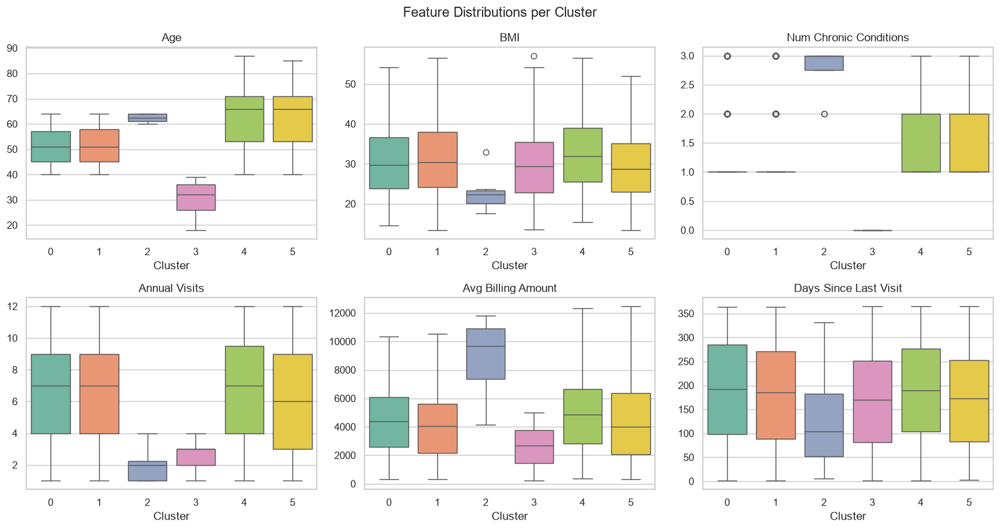

# Patient Segmentation with Clustering

Segmenting 2,000 patients into clinically meaningful groups using unsupervised
learning — and specifically, why the "obvious" clustering algorithm (K-Means) is
the wrong tool once your data mixes numeric and categorical features, and what to
use instead.

## Origins & attribution

This project started as a DataCamp Code-Along webinar, *"Machine Learning for
Healthcare,"* presented by Eugenia Inzaugarat (Senior Data Scientist & Co-founder,
Insight Delta). The dataset and the overall exercise structure (explore → clean →
cluster → interpret → predict) come from that session.

I extended the reference solution and fixed several bugs in it before publishing
here, including:
- A `NameError`-inducing dead cell (referenced an undefined variable, was a
  redundant leftover from an earlier draft) — removed.
- Two cells referencing an undefined `profile` variable instead of the actual
  `cluster_profiles` DataFrame — fixed.
- The "predict a new patient's segment" demo, which fabricated random cluster
  labels (`np.random.randint(...)`) instead of using the real fitted cluster
  assignments, and encoded the sample patient's categorical fields as arbitrary
  integers that didn't match the real string-valued columns — silently producing
  meaningless results. Rewrote it to use the actual model output.
- A `scipy`/`gower` compatibility issue that broke the dendrogram and distance
  computation on current library versions.
- Removed platform-specific data-loading syntax, redundant imports, and workshop
  scaffolding so the notebook runs cleanly top-to-bottom in a standard Python
  environment.

I also used an AI coding assistant throughout to draft parts of the
implementation — the notebook narrates that process, including a case where the
AI's first suggestion (K-Means) turned out to be the wrong tool for this data,
and why.

## Problem

A healthcare organization — whether a small clinic or a large hospital network —
benefits from knowing its patient population as a set of meaningful groups rather
than as 2,000 individual rows. Clustering offers a way to discover those groups
without needing any labeled outcome to predict.

## Dataset

`data/patient_insurance_dataset.csv` — 2,000 synthetic patient records, 16 columns:

| Column | Description |
|---|---|
| `PatientID` | Unique patient identifier |
| `Age` | Patient age (18–87) |
| `Gender` | Male / Female |
| `State`, `City` | Location (`City` has ~50% disguised missing values recorded as `"Unknown"`) |
| `Height_cm`, `Weight_kg`, `BMI` | Body measurements (BMI range 13.4–57.1) |
| `Insurance_Type` | Private, Medicare, Medicaid, or Self-Pay |
| `Primary_Condition` | Diagnosed condition, e.g. Hypertension, Diabetes, Asthma (disguised missing values recorded as `"None"`) |
| `Num_Chronic_Conditions` | Count of chronic conditions |
| `Annual_Visits` | Visits per year |
| `Avg_Billing_Amount` | Average billing amount per visit ($207–$12,467) |
| `Last_Visit_Date`, `Days_Since_Last_Visit` | Recency of last visit |
| `Preventive_Care_Flag` | Whether the patient received preventive care |

No single column is a prediction target — this is unsupervised segmentation.

## Approach

1. **Explore & clean.** Beyond checking for `NaN`, the notebook specifically
   checks for *disguised* missing values — placeholder strings like `"Unknown"`
   and `"None"` that pandas won't flag on its own. `City` turns out to be ~50%
   missing (too high to impute, dropped from modeling); a missing
   `Primary_Condition` is filled with `'No Condition'`, since its absence is
   itself meaningful rather than a gap to patch over.

2. **Understand the features.** A correlation heatmap surfaces redundancy (BMI
   correlates strongly with height/weight, so only BMI is kept) and structure
   (age, chronic conditions, visit frequency, and billing move together).

   

3. **Try K-Means — and see it fail.** The natural first instinct (and what most
   AI coding assistants suggest by default) is K-Means on one-hot-encoded,
   scaled features. The elbow method is ambiguous, and the result is misleading:

   

   Projected into 2D, the "clusters" it finds aren't really separated at all —
   just an arbitrary split down one continuous blob of patients:

   

   The underlying problem isn't the choice of *k* — it's that K-Means relies on
   Euclidean distance, which breaks down on mixed categorical/numeric data:
   one-hot encoding inflates dimensionality, treats every binary column as
   equally weighted, and discards any real similarity structure between
   categories (e.g. "Private" vs. "Medicare" insurance are treated as no more
   or less similar than any other pair).

4. **Switch to a distance measure built for mixed data.** [Gower distance](https://en.wikipedia.org/wiki/Gower%27s_distance)
   (1971) computes per-feature distances appropriately for each data type —
   normalized Manhattan distance for numeric features, simple matching for
   categorical ones — then averages them. Paired with **agglomerative
   (hierarchical) clustering** on the precomputed distance matrix, this needs no
   one-hot encoding and no upfront choice of *k*.

5. **Pick *k* via silhouette score, then interpret the result.** Testing
   cluster counts from 2–10, **k=6** gives the best silhouette score (≈0.27).

   

   Each cluster is profiled by its average numeric features and most common
   categorical values, and turned into a plain-language segment summary — the
   part that actually makes clustering useful to a non-technical stakeholder.

   

6. **Assign a new patient to a segment.** A trained clustering model is only
   useful if new patients can be classified without re-running the whole
   pipeline. The notebook implements a function that computes the Gower-style
   distance from a new patient to every existing patient, averages that distance
   within each cluster, and returns the closest one.

## Results

- **6 patient segments**, distinguished primarily by age, chronic condition
  burden, visit frequency, billing amount, and insurance type.
- **Silhouette score ≈ 0.27** for the chosen clustering (agglomerative, average
  linkage, precomputed Gower distances, k=6) — modest but expected for
  real-world mixed-type healthcare data with no ground-truth labels.
- A working new-patient classifier: for a sample 55-year-old Medicare patient
  with hypertension, the model assigns a specific closest cluster with a full
  breakdown of average distance to every segment (not a fabricated placeholder
  result, unlike the original demo).

## Repository structure

```
patient-segmentation-healthcare/
├── README.md
├── requirements.txt
├── LICENSE
├── data/
│   └── patient_insurance_dataset.csv
├── notebooks/
│   └── patient_segmentation_analysis.ipynb
└── assets/
    └── (exported figures used in this README)
```

## Running it locally

```bash
python -m venv .venv
source .venv/bin/activate   # .venv\Scripts\activate on Windows
pip install -r requirements.txt
jupyter notebook notebooks/patient_segmentation_analysis.ipynb
```

## Tech stack

Python · pandas · NumPy · scikit-learn · [`gower`](https://pypi.org/project/gower/) ·
SciPy · seaborn · Matplotlib · Jupyter

## License

Released under the [MIT License](LICENSE). The dataset and original exercise
structure are from the DataCamp Code-Along session credited above.
